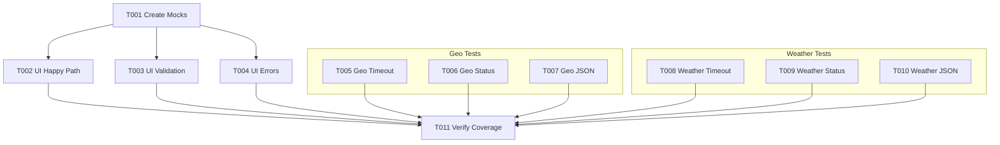

# Tasks: Increase Unit Test Coverage

**Input**: Design documents from `/specs/002-increase-test-coverage/`
**Prerequisites**: plan.md (required), spec.md (required for user stories), research.md, data-model.md

**Tests**: Testing is mandatory per the Constitution. Tasks MUST include unit tests to meet 80% coverage requirements.

**Organization**: Tasks are grouped by user story to enable independent implementation and testing of each story.

## Format: `[ID] [P?] [Story] Description`

- **[P]**: Can run in parallel (different files, no dependencies)
- **[Story]**: Which user story this task belongs to (e.g., US1, US2, US3)
- Include exact file paths in descriptions

## Phase 1: Setup (Shared Infrastructure)

**Purpose**: Project initialization and basic structure

- [ ] T001 Create mock implementations for `GeocodingService` and `WeatherService` in `src/internal/ui/mocks_test.go`

---

## Phase 2: Foundational (Blocking Prerequisites)

**Purpose**: Core infrastructure that MUST be complete before ANY user story can be implemented

*No foundational tasks required for this feature as project structure is already established.*

---

## Phase 3: User Story 1 - Verify Code Coverage (Priority: P1) 🎯 MVP

**Goal**: Ensure all core packages (`ui`, `geo`, `weather`) meet the 80% code coverage threshold with robust, deterministic tests.

**Independent Test**: Run `go test -cover ./src/internal/...` and verify all packages report >= 80% coverage.

### Tests for User Story 1

> **NOTE: Write these tests FIRST, ensure they FAIL before implementation**

*Tests are the implementation for this feature.*

### Implementation for User Story 1

**UI Component (Priority High - currently failing)**

- [ ] T002 [US1] Implement unit tests for `GetLocation` (happy path) in `src/internal/ui/prompt_test.go`
- [ ] T003 [US1] Implement unit tests for `GetLocation` (input validation: empty, long strings) in `src/internal/ui/prompt_test.go`
- [ ] T004 [US1] Implement unit tests for `GetLocation` (service error handling) in `src/internal/ui/prompt_test.go`

**Geo Component (Hardening)**

- [ ] T005 [P] [US1] Add test case for API timeout to `src/internal/geo/client_test.go`
- [ ] T006 [P] [US1] Add test case for non-200 API status to `src/internal/geo/client_test.go`
- [ ] T007 [P] [US1] Add test case for malformed JSON response to `src/internal/geo/client_test.go`

**Weather Component (Hardening)**

- [ ] T008 [P] [US1] Add test case for API timeout to `src/internal/weather/client_test.go`
- [ ] T009 [P] [US1] Add test case for non-200 API status to `src/internal/weather/client_test.go`
- [ ] T010 [P] [US1] Add test case for malformed JSON response to `src/internal/weather/client_test.go`

**Checkpoint**: At this point, User Story 1 should be fully functional and testable independently

---

## Final Phase: Polish & Cross-Cutting Concerns

**Purpose**: Final cleanup, documentation, and non-functional requirements

- [ ] T011 Verify 80% coverage across all packages by running `go test -cover ./src/internal/...`

## Dependencies

## Parallel Execution Examples

**Scenario: 2 Developers**

- **Dev 1**: Focuses on UI Component (T001, T002, T003, T004)
- **Dev 2**: Focuses on Geo & Weather Components (T005-T010)

## Implementation Strategy

1.  **Setup**: Create the shared mocks first (T001) as they are required for the UI tests.
2.  **UI First**: Tackle the UI package immediately as it is currently below the threshold.
3.  **Hardening**: Add the edge case tests to Geo and Weather packages in parallel to improve robustness and buffer the coverage metric.
4.  **Verify**: Run the full suite to confirm compliance.
