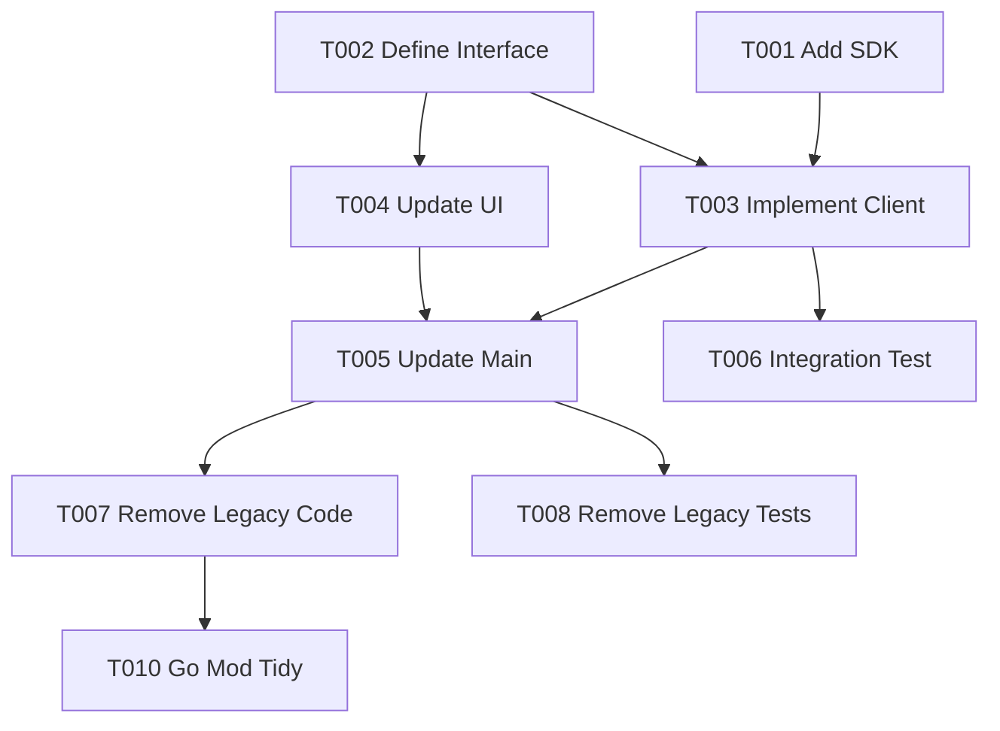

# Tasks: Integrate Open-Meteo SDK

**Spec**: [specs/004-use-meteo-sdk/spec.md](specs/004-use-meteo-sdk/spec.md)
**Plan**: [specs/004-use-meteo-sdk/plan.md](specs/004-use-meteo-sdk/plan.md)

## Phase 1: Setup
*Goal: Initialize project dependencies.*

- [x] T001 Add `open-meteo-weather-sdk` dependency to `go.mod`

## Phase 2: Foundational
*Goal: Establish interfaces and SDK integration layer.*

- [x] T002 Define `WeatherResponse` interface with `QuantityOf...` accessors in `internal/models/interfaces.go`
- [x] T003 Implement SDK client wrapper in `internal/weather/client.go` enforcing 10s timeout and handling nil returns

## Phase 3: User Story 1 - Maintain Existing Weather Retrieval Functionality
*Goal: Switch application to use SDK without regression.*
*Independent Test: Run `weather-reporter "London"` and verify output matches previous format.*

- [x] T004 [US1] Update UI display logic in `internal/ui/prompt.go` to use `WeatherResponse` interface
- [x] T005 [US1] Refactor `cmd/weather-reporter/main.go` to use new SDK client
- [x] T006 [US1] Add integration test for SDK client in `internal/weather/integration_test.go` (success, timeout, error propagation)

## Phase 4: User Story 2 - Reduce Maintenance Burden
*Goal: Remove legacy code and tests.*
*Independent Test: Verify `internal/weather` contains only SDK wrapper code.*

- [x] T007 [US2] Remove legacy weather client code and structs from `internal/weather/` and `internal/models/`
- [x] T008 [US2] Remove obsolete unit tests in `internal/weather/client_test.go`

## Final Phase: Polish
*Goal: Cleanup and documentation.*

- [x] T009 Update `README.md` to reflect new SDK dependency
- [x] T010 Run `go mod tidy` to clean up dependencies

## Dependencies

## Implementation Strategy
1.  **Setup**: Get the SDK installed.
2.  **Interfaces**: Define the contract based on `contracts/sdk-adapter.go`.
3.  **Implementation**: Create the wrapper that calls the SDK and adapts the response (if necessary, or just passes it through if it matches).
4.  **Integration**: Wire it up in `main.go` and update the UI to use the new accessors.
5.  **Cleanup**: Delete the old code.
